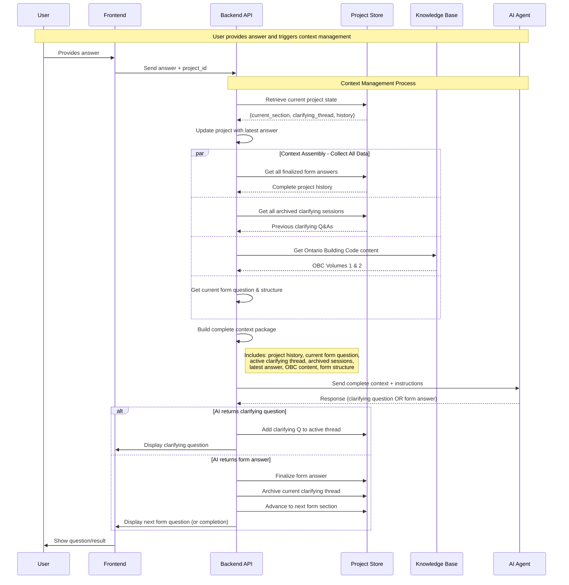

# Context Management Design Documentation

## Overview
This document specifies the context management system for the Adaptive AI Wizard for Form Completion. Context management is responsible for assembling complete information packages for the AI agent and managing the lifecycle of form questions and clarifying questions throughout the project.

## Design Philosophy

### Simplicity Over Optimization
- **Always include everything**: Complete context is provided to AI in every call
- **No negotiation loops**: Single round-trip communication between Backend and AI
- **Full transparency**: AI has access to all available knowledge sources in each interaction

### Context Package Format: Hybrid Approach
- **Input to AI**: Structured text/markdown (natural language processing friendly)
- **Output from AI**: JSON (structured parsing for backend)

## Context Package Structure

### Context Input to AI (Markdown Format)
```markdown
# Form Completion Project - Context Package

## Project History (Completed Form Questions)
1. **Building Height**: 3 stories
2. **Floor Area**: 2,500 sq ft per floor

## Current Form Question
**Section 3.1**: What is the building's primary occupancy classification?

## Active Clarifying Discussion
- Q: What activities will primarily take place in this building?
- A: Office work and meetings
- Q: Will there be any retail or public access areas?  
- A: No, private office only

## Latest User Response
"Private office building for 50 employees"

## Archived Clarifying Sessions
### Section 2.1 - Building Height Discussion
- Q: How many floors will the building have?
- A: Three floors
- Q: What is the height of each floor?
- A: 12 feet per floor

### Section 2.2 - Floor Area Discussion
- Q: What is the total footprint of each floor?
- A: 2,500 square feet identical on each floor

## Ontario Building Code Reference
[Complete OBC Volumes 1 & 2 content available]

## Form Structure
[Complete form question sequence and validation rules]

## Required Response Format
Respond with JSON:
{
  "type": "form_answer" | "clarifying_question",
  "content": "...",
  "confidence": 0.0-1.0,
  "obc_references": ["Section X.X.X"] // optional
}
```

## Context Lifecycle Management

### Clarifying Question Lifecycle
1. **Active Phase**: Clarifying questions for current form question stored in active thread
2. **Archive Phase**: When form question is finalized, clarifying thread moves to archived sessions
3. **Reuse Phase**: Archived sessions included in all future context packages for potential reuse

### Rationale for Keeping Archived Sessions
- **Building characteristics affect multiple form questions**: Information gathered for one form question often relevant to later questions
- **User communication patterns**: Understanding how user describes their project helps with future clarifications
- **Technical concept reuse**: Building code concepts and definitions may apply across multiple form sections

## Project State Management

### Project Persistence
- **Storage**: Abstracted persistence layer (file storage for MVP, easily swappable)
- **Project Structure**:
  ```json
  {
    "project_id": "uuid",
    "current_form_section": "3.1",
    "finalized_answers": [
      {"section": "1.1", "question": "...", "answer": "..."},
      {"section": "2.1", "question": "...", "answer": "..."}
    ],
    "active_clarifying_thread": [
      {"question": "...", "answer": "..."}
    ],
    "archived_clarifying_sessions": {
      "1.1": [{"question": "...", "answer": "..."}],
      "2.1": [{"question": "...", "answer": "..."}]
    },
    "created_at": "timestamp",
    "updated_at": "timestamp"
  }
  ```

### Project Initialization
- **Empty context**: New projects start with no history
- **First form question**: Always the same starting point
- **Progressive building**: Context grows with each user interaction

## Context Assembly Process

### Complete Data Collection Strategy
Backend assembles context by collecting ALL available data:

1. **Project History**: All finalized form questions and answers
2. **Current Form Question**: The active form question being resolved
3. **Active Clarifying Thread**: All clarifying Q&As for current form question
4. **Archived Clarifying Sessions**: All previous clarifying discussions
5. **Latest User Answer**: Most recent user response
6. **Ontario Building Code**: Complete OBC content (Volumes 1 & 2)
7. **Form Structure**: Complete form question sequence and validation rules

### Context Assembly Logic
```python
def build_complete_context(project_state):
    return {
        "project_history": get_all_finalized_form_answers(project_state),
        "current_form_section": project_state.current_section,
        "current_form_question": get_form_question(project_state.current_section),
        "active_clarifying_thread": project_state.active_clarifying_thread,
        "archived_clarifying_sessions": project_state.archived_clarifying_sessions,
        "latest_user_answer": project_state.latest_answer,
        "ontario_building_code": get_complete_obc_content(),
        "form_structure": get_complete_form_structure()
    }
```

## AI Response Processing

### Valid AI Response Types
1. **Clarifying Question**: AI needs more information to resolve current form question
2. **Form Answer**: AI has sufficient information to provide final answer to current form question

### Response Processing Logic
```python
def process_ai_response(ai_response, project_state):
    if ai_response.type == "clarifying_question":
        # Add to active clarifying thread
        project_state.active_clarifying_thread.append({
            "question": ai_response.content,
            "answer": None  # Will be filled when user responds
        })
        return render_clarifying_question(ai_response.content)
    
    elif ai_response.type == "form_answer":
        # Finalize current form question
        finalize_form_answer(project_state, ai_response.content)
        
        # Archive clarifying thread
        archive_clarifying_thread(project_state)
        
        # Advance to next form section
        advance_to_next_form_section(project_state)
        
        if has_more_form_questions(project_state):
            return render_next_form_question()
        else:
            return render_completed_form()
```

## Context Management Sequence Diagram



## Knowledge Base Integration

### Ontario Building Code Access
- **Complete inclusion**: Full OBC Volumes 1 & 2 included in every context package
- **Section-based organization**: OBC already has proper section numbering system
- **On-demand referencing**: AI can reference any OBC section as needed
- **Form integration**: Form questions explicitly reference relevant OBC sections

### Form Structure Integration
- **Complete form definition**: Full form question sequence available to AI
- **Validation rules**: AI understands expected answer formats and constraints
- **Sequential progression**: AI knows current position in form and remaining questions

## Implementation Considerations

### Areas Designed for Rapid Adaptation
1. **Storage layer**: Easily swappable persistence mechanisms
2. **Knowledge request patterns**: Flexible approach to how AI requests specific information
3. **Context assembly logic**: Modular design allows for optimization and filtering later
4. **Error handling strategies**: Intentionally deferred for learning from prototype experience

### Intentionally Deferred Decisions
1. **Project timeout/expiration logic**: Storage implementation detail
2. **AI response validation schema**: Will be defined during API implementation
3. **Error handling specifics**: Learn from prototype, iterate based on real usage
4. **Context size optimization**: Not a concern given form scope, but designed for future optimization

### MVP Prototype Considerations
- **Simple file storage**: Easy to implement and debug
- **No token optimization**: Include everything for maximum AI capability
- **Minimal error handling**: Focus on happy path, learn from edge cases
- **Complete transparency**: AI has full visibility into all available information

## Trade-offs and Benefits

### Benefits of "Always Include Everything" Approach
- **Simplified backend logic**: No complex decision-making about what to include
- **Maximum AI capability**: AI has complete information to make best decisions
- **Consistent behavior**: Same information available in every interaction
- **Easier debugging**: Full context visibility for troubleshooting

### Trade-offs
- **Higher token usage**: Larger context packages in every AI call
- **Potentially slower responses**: More data to process
- **Storage requirements**: Need to maintain complete history

### Future Optimization Opportunities
- **Smart context filtering**: Learn which information is most valuable
- **Incremental context building**: Add information only when needed
- **Context summarization**: Compress older information while maintaining relevance
- **Selective knowledge base inclusion**: Include only relevant OBC sections
