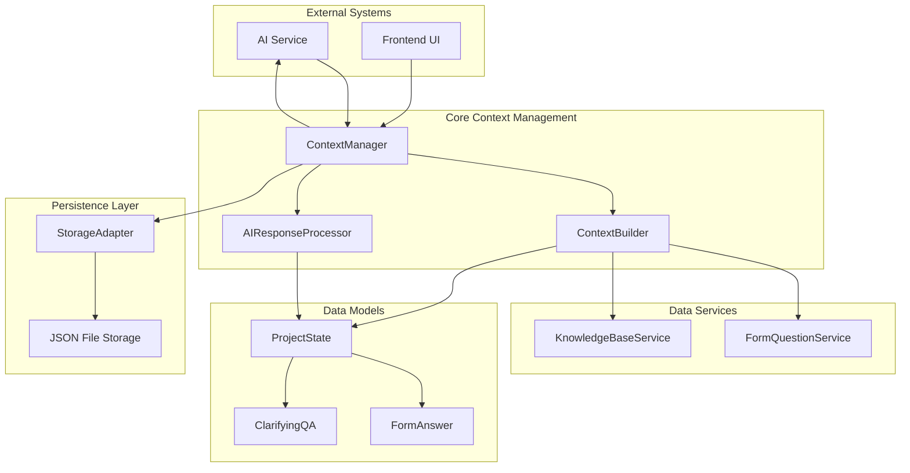
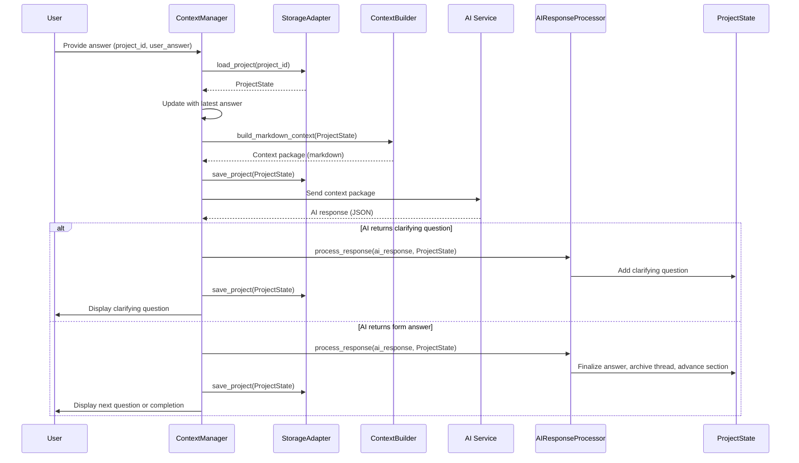

# Context Management Implementation Design

## Overview
This document outlines the component architecture and class design for implementing the context management system as described in the design documentation. The implementation focuses on simplicity, flexibility, and ease of iteration for the POC/MVP phase.

## Component Architecture



## Class Definitions

### 1. ProjectState (Data Model)
Represents the complete state of a form completion project.

```python
class ProjectState:
    """Represents the current state of a form completion project."""
    
    def __init__(self, project_id: str):
        self.project_id: str = project_id
        self.current_form_section: str = "3.01"  # Starting section
        self.finalized_answers: List[FormAnswer] = []
        self.active_clarifying_thread: List[ClarifyingQA] = []
        self.archived_clarifying_sessions: Dict[str, List[ClarifyingQA]] = {}
        self.latest_user_answer: Optional[str] = None
        self.created_at: datetime = datetime.now()
        self.updated_at: datetime = datetime.now()
```

### 2. FormAnswer (Data Model)
```python
class FormAnswer:
    """Represents a finalized answer to a form question."""
    
    def __init__(self, section: str, question_number: str, question: str, answer: str):
        self.section: str = section
        self.question_number: str = question_number  # e.g., "3.1.2"
        self.question: str = question
        self.answer: str = answer
        self.timestamp: datetime = datetime.now()
```

### 3. ClarifyingQA (Data Model)
```python
class ClarifyingQA:
    """Represents a clarifying question and answer pair related to a specific form question."""
    
    def __init__(self, question: str, related_form_section: str, answer: Optional[str] = None):
        self.question: str = question
        self.related_form_section: str = related_form_section  # Links to FormQuestion section
        self.answer: Optional[str] = answer
        self.timestamp: datetime = datetime.now()
```

### 4. ContextManager (Main Orchestrator)
```python
class ContextManager:
    """Orchestrates the complete context management process."""
    
    def __init__(self, 
                 storage_adapter: StorageAdapter,
                 form_service: FormQuestionService,
                 knowledge_service: KnowledgeBaseService):
        self.storage = storage_adapter
        self.form_service = form_service
        self.knowledge_service = knowledge_service
        self.context_builder = ContextBuilder(form_service, knowledge_service)
        self.response_processor = AIResponseProcessor()
    
    def process_user_response(self, project_id: str, user_answer: str) -> Dict:
        """Main entry point: process user response and return AI context."""
        # Load project state
        project_state = self.storage.load_project(project_id)
        
        # Update with latest answer
        project_state.latest_user_answer = user_answer
        project_state.updated_at = datetime.now()
        
        # Build complete context
        context_package = self.context_builder.build_markdown_context(project_state)
        
        # Save updated state
        self.storage.save_project(project_state)
        
        return {
            "context": context_package,
            "project_state": project_state
        }
    
    def process_ai_response(self, project_id: str, ai_response: Dict) -> Dict:
        """Process AI response and update project state accordingly."""
        project_state = self.storage.load_project(project_id)
        result = self.response_processor.process(ai_response, project_state)
        
        # Save updated state
        self.storage.save_project(project_state)
        
        return result
```

### 5. ContextBuilder
```python
class ContextBuilder:
    """Builds the complete context package in markdown format."""
    
    def __init__(self, form_service: FormQuestionService, knowledge_service: KnowledgeBaseService):
        self.form_service = form_service
        self.knowledge_service = knowledge_service
    
    def build_markdown_context(self, project_state: ProjectState) -> str:
        """Build complete context package in markdown format."""
        context_lines = [
            "# Form Completion Project - Context Package",
            "",
            "## Project History (Completed Form Questions)"
        ]
        
        # Add finalized answers
        for i, answer in enumerate(project_state.finalized_answers, 1):
            context_lines.append(f"{i}. **{answer.question_number} - {answer.question}**: {answer.answer}")
        
        # Add current form question
        current_question = self.form_service.get_question(project_state.current_form_section)
        context_lines.extend([
            "",
            "## Current Form Question",
            f"**{project_state.current_form_section}**: {current_question}",
            ""
        ])
        
        # Add active clarifying discussion
        if project_state.active_clarifying_thread:
            context_lines.append("## Active Clarifying Discussion")
            for qa in project_state.active_clarifying_thread:
                context_lines.append(f"- Q: {qa.question}")
                if qa.answer:
                    context_lines.append(f"- A: {qa.answer}")
        
        # Add latest user response
        if project_state.latest_user_answer:
            context_lines.extend([
                "",
                "## Latest User Response",
                f'"{project_state.latest_user_answer}"',
                ""
            ])
        
        # Add archived clarifying sessions
        if project_state.archived_clarifying_sessions:
            context_lines.append("## Archived Clarifying Sessions")
            for section, sessions in project_state.archived_clarifying_sessions.items():
                context_lines.append(f"### {section} Discussion")
                for qa in sessions:
                    context_lines.append(f"- Q: {qa.question}")
                    context_lines.append(f"- A: {qa.answer}")
        
        # Add knowledge base references
        context_lines.extend([
            "",
            "## Ontario Building Code Reference",
            "[Complete OBC Volumes 1 & 2 content available]",
            "",
            "## Form Structure",
            "[Complete form question sequence and validation rules]",
            "",
            "## Required Response Format",
            "Respond with JSON:",
            "{",
            '  "type": "form_answer" | "clarifying_question",',
            '  "content": "...",',
            '  "confidence": 0.0-1.0,',
            '  "obc_references": ["Section X.X.X"] // optional',
            "}"
        ])
        
        return "\n".join(context_lines)
```

### 6. AIResponseProcessor
```python
class AIResponseProcessor:
    """Processes AI responses and updates project state."""
    
    def process(self, ai_response: Dict, project_state: ProjectState) -> Dict:
        """Process AI response and update project state."""
        response_type = ai_response.get("type")
        
        if response_type == "clarifying_question":
            return self._process_clarifying_question(ai_response, project_state)
        elif response_type == "form_answer":
            return self._process_form_answer(ai_response, project_state)
        else:
            raise ValueError(f"Unknown AI response type: {response_type}")
    
    def _process_clarifying_question(self, ai_response: Dict, project_state: ProjectState) -> Dict:
        """Process clarifying question response."""
        clarifying_qa = ClarifyingQA(
            question=ai_response["content"],
            related_form_section=project_state.current_form_section
        )
        project_state.active_clarifying_thread.append(clarifying_qa)
        
        return {
            "type": "clarifying_question",
            "question": ai_response["content"],
            "requires_user_response": True
        }
    
    def _process_form_answer(self, ai_response: Dict, project_state: ProjectState) -> Dict:
        """Process form answer response."""
        # Create finalized answer
        current_question = project_state.current_form_section
        question_text = "TODO: Get question text from form service"  # Will be implemented
        form_answer = FormAnswer(
            section=current_question,
            question_number=current_question,  # Use section as question number
            question=question_text,
            answer=ai_response["content"]
        )
        
        # Add to finalized answers
        project_state.finalized_answers.append(form_answer)
        
        # Archive current clarifying thread
        if project_state.active_clarifying_thread:
            project_state.archived_clarifying_sessions[current_question] = (
                project_state.active_clarifying_thread.copy()
            )
            project_state.active_clarifying_thread.clear()
        
        # AI determines next question - we don't pre-define sequence
        # The AI will specify the next question in its response
        
        return {
            "type": "form_answer",
            "answer": ai_response["content"],
            "requires_user_response": False
        }
```

### 7. FormQuestionService
```python
class FormQuestionService:
    """Manages form questions and structure."""
    
    def __init__(self, form_structure_path: str = "data/form_structure.json"):
        self.form_structure = self._load_form_structure(form_structure_path)
    
    def get_question(self, section: str) -> str:
        """Get question text for a specific section."""
        return self.form_structure.get(section, {}).get("question", "Unknown question")
    
    def get_next_section(self, current_section: str) -> Optional[str]:
        """Get the next section in the form sequence."""
        sections = list(self.form_structure.keys())
        try:
            current_index = sections.index(current_section)
            if current_index + 1 < len(sections):
                return sections[current_index + 1]
        except ValueError:
            pass
        return None
    
    def get_form_structure(self) -> Dict:
        """Get complete form structure."""
        return self.form_structure
    
    def _load_form_structure(self, path: str) -> Dict:
        """Load form structure from JSON file."""
        # MVP implementation - will be replaced with actual file loading
        return {
            "1.1": {"question": "What is the building type?", "type": "multiple_choice"},
            "1.2": {"question": "What is the approximate size?", "type": "numerical"},
            "2.1": {"question": "What is the building height?", "type": "numerical"},
            "2.2": {"question": "What is the floor area?", "type": "numerical"},
            "3.1": {"question": "What is the primary occupancy classification?", "type": "multiple_choice"}
        }
```

### 8. KnowledgeBaseService
```python
class KnowledgeBaseService:
    """Provides access to Ontario Building Code and other knowledge."""
    
    def __init__(self, obc_path: str = "data/obc_content.json"):
        self.obc_content = self._load_obc_content(obc_path)
    
    def get_obc_content(self) -> str:
        """Get complete OBC content."""
        return self.obc_content
    
    def get_relevant_sections(self, keywords: List[str]) -> str:
        """Get OBC sections relevant to specific keywords."""
        # Simple keyword matching for MVP
        relevant_content = []
        for section, content in self.obc_content.items():
            if any(keyword.lower() in content.lower() for keyword in keywords):
                relevant_content.append(f"### {section}\n{content}")
        
        return "\n\n".join(relevant_content) if relevant_content else "No relevant sections found."
    
    def _load_obc_content(self, path: str) -> Dict[str, str]:
        """Load OBC content from JSON file."""
        # MVP implementation - will be replaced with actual file loading
        return {
            "3.1.1": "Buildings shall be classified according to their major occupancy...",
            "3.2.1": "The height and area of buildings shall be limited based on construction type...",
            "9.10.1": "Fire separations shall be provided between different occupancies...",
            # More sections would be added here
        }
```

### 9. StorageAdapter (Interface)
```python
class StorageAdapter(ABC):
    """Abstract interface for project persistence."""
    
    @abstractmethod
    def load_project(self, project_id: str) -> ProjectState:
        """Load project state from storage."""
        pass
    
    @abstractmethod
    def save_project(self, project_state: ProjectState) -> None:
        """Save project state to storage."""
        pass
```

### 10. JSONFileStorageAdapter (MVP Implementation)
```python
class JSONFileStorageAdapter(StorageAdapter):
    """JSON file-based storage implementation for MVP."""
    
    def __init__(self, storage_dir: str = "data/projects"):
        self.storage_dir = storage_dir
        os.makedirs(storage_dir, exist_ok=True)
    
    def load_project(self, project_id: str) -> ProjectState:
        """Load project state from JSON file."""
        file_path = self._get_file_path(project_id)
        
        if not os.path.exists(file_path):
            # Return new project state if not found
            return ProjectState(project_id)
        
        with open(file_path, 'r') as f:
            data = json.load(f)
        
        # Convert JSON data back to ProjectState object
        project_state = ProjectState(project_id)
        # TODO: Implement proper deserialization
        return project_state
    
    def save_project(self, project_state: ProjectState) -> None:
        """Save project state to JSON file."""
        file_path = self._get_file_path(project_state.project_id)
        
        # Convert ProjectState to JSON-serializable dict
        data = {
            "project_id": project_state.project_id,
            "current_form_section": project_state.current_form_section,
            "finalized_answers": [
                {"section": fa.section, "question": fa.question, "answer": fa.answer, "timestamp": fa.timestamp.isoformat()}
                for fa in project_state.finalized_answers
            ],
            "active_clarifying_thread": [
                {"question": qa.question, "answer": qa.answer, "timestamp": qa.timestamp.isoformat()}
                for qa in project_state.active_clarifying_thread
            ],
            "archived_clarifying_sessions": {
                section: [
                    {"question": qa.question, "answer": qa.answer, "timestamp": qa.timestamp.isoformat()}
                    for qa in sessions
                ]
                for section, sessions in project_state.archived_clarifying_sessions.items()
            },
            "latest_user_answer": project_state.latest_user_answer,
            "created_at": project_state.created_at.isoformat(),
            "updated_at": project_state.updated_at.isoformat()
        }
        
        with open(file_path, 'w') as f:
            json.dump(data, f, indent=2)
    
    def _get_file_path(self, project_id: str) -> str:
        """Get file path for project storage."""
        return os.path.join(self.storage_dir, f"project_{project_id}.json")
```

## Data Flow Sequence



## Example Full Context Structure

```markdown
# Form Completion Project - Context Package

## Project History (Completed Form Questions)
1. **3.1.1 - Building Type**: Office building
2. **3.1.2 - Building Height**: 3 stories
3. **3.1.3 - Floor Area**: 2,500 sq ft per floor

## Current Form Question
**3.2.1**: What is the building's primary occupancy classification?

## Active Clarifying Discussion
- Q: What activities will primarily take place in this building?
- A: Office work and meetings
- Q: Will there be any retail or public access areas?
- A: No, private office only

## Latest User Response
"Private office building for 50 employees"

## Archived Clarifying Sessions
### 3.1.1 - Building Type Discussion
- Q: Is this a residential or commercial building?
- A: Commercial office building
- Q: Any special architectural features?
- A: Modern glass facade

### 3.1.2 - Building Height Discussion
- Q: How many floors will the building have?
- A: Three floors
- Q: What is the height of each floor?
- A: 12 feet per floor

### 3.1.3 - Floor Area Discussion
- Q: What is the total footprint of each floor?
- A: 2,500 square feet identical on each floor
- Q: Any irregular floor shapes or areas?
- A: Rectangular footprint, no irregularities

## Ontario Building Code Reference
### Division A - Compliance Objectives
1.1.1.1. Application
(1) This Code applies to the construction and renovation of buildings.
(2) The objectives of this Code are to ensure public safety, health, and accessibility.

### Division B - Acceptable Solutions
3.1.1.1. Classification of Buildings
(1) Buildings shall be classified according to their major occupancy as Group A, B, C, D, E, or F.
(2) Office buildings are typically classified as Group D - Business and Personal Services.

3.2.1.1. Building Height and Area
(1) The height and area of buildings shall be limited based on construction type and occupancy classification.
(2) For Group D occupancies, maximum building height is typically 4 stories for combustible construction.

9.10.1.1. Fire Separations
(1) Fire separations shall be provided between different occupancies and areas of different fire risks.
(2) Office buildings require 1-hour fire resistance rating between floors.

## Form Structure
### Section 3.1 - Building Characteristics
3.1.1: What is the building type? (e.g., residential, commercial, industrial)
3.1.2: What is the building height? (number of stories)
3.1.3: What is the floor area? (square feet per floor)

### Section 3.2 - Occupancy and Use
3.2.1: What is the building's primary occupancy classification?
3.2.2: Will there be any secondary occupancies or mixed uses?
3.2.3: What is the maximum occupant load expected?

### Section 3.3 - Construction Details
3.3.1: What are the primary construction materials?
3.3.2: What type of foundation will be used?
3.3.3: What is the roof construction type?

### Section 3.4 - Safety Systems
3.4.1: What fire protection systems will be installed?
3.4.2: What emergency exiting provisions are planned?
3.4.3: What accessibility features will be included?

## Required Response Format
Respond with JSON:
{
  "type": "form_answer" | "clarifying_question",
  "content": "...",
  "confidence": 0.0-1.0,
  "obc_references": ["Section X.X.X"] // optional
}
```

## Implementation Roadmap

### Phase 1: MVP Core (Week 1)
- [ ] Implement ProjectState, FormAnswer, ClarifyingQA data models
- [ ] Create JSONFileStorageAdapter with basic serialization
- [ ] Implement FormQuestionService with mock form structure
- [ ] Implement KnowledgeBaseService with mock OBC content
- [ ] Create ContextBuilder for markdown generation
- [ ] Implement AIResponseProcessor for basic response handling

### Phase 2: Integration (Week 2)
- [ ] Integrate ContextManager with existing ProjectService
- [ ] Create API endpoints for context management
- [ ] Add proper error handling and validation
- [ ] Implement actual form structure loading from JSON
- [ ] Implement actual OBC content loading

### Phase 3: Enhancement (Week 3)
- [ ] Add comprehensive logging
- [ ] Implement proper serialization/deserialization
- [ ] Add unit tests for all components
- [ ] Optimize context building performance
- [ ] Add support for multiple knowledge sources

## File Structure
```
app/
  services/
    context_manager.py          # Main ContextManager class
    form_question_service.py    # Form question management
    knowledge_base_service.py   # OBC and knowledge access
    ai_response_processor.py    # AI response handling
  models/
    project_state.py            # ProjectState data model
    form_answer.py              # FormAnswer data model
    clarifying_qa.py            # ClarifyingQA data model
  storage/
    storage_adapter.py          # Abstract interface
    json_storage_adapter.py     # JSON file implementation
data/
  projects/                     # Project state JSON files
  form_structure.json           #
