# Section Interaction Flow Documentation

This document provides a comprehensive overview of how users interact with the section endpoints and the AI service in the BuildSure application.

## Overview

The section interaction system enables users to complete building permit sections through a conversational AI interface. The system integrates with the Ontario Building Code knowledge base to ensure compliance and generate appropriate questions and responses.

## Flow Diagram

```mermaid
flowchart TD
    %% User Actions
    User[👤 User] 
    
    %% API Endpoints
    StartAPI["🚀 POST /projects/ID/sections/NUM/start"]
    AnswerAPI["💬 POST /projects/ID/sections/NUM/answer"]
    ConfirmAPI["✅ POST /projects/ID/sections/NUM/confirm"]
    
    %% Services
    SectionService[📋 Section Service]
    AIService["🤖 AI Service<br/>Google Gemini"]
    
    %% Database Tables
    ProjectsDB[("🏗️ projects<br/>- current_section<br/>- status<br/>- completed_sections")]
    SectionsDB[("📄 sections<br/>- status<br/>- draft_output<br/>- final_output<br/>- user_input*")]
    AnswersDB[("💭 answers<br/>- question_text<br/>- answer_text<br/>- question_type")]
    OntarioChunksDB[("📚 ontario_chunks<br/>- division<br/>- chunk_type<br/>- content")]
    
    %% Decision Points
    AIDecision{"🧠 AI Decision<br/>Enough Info?"}
    
    %% Responses
    InitialQuestion[❓ Initial Question Response]
    ClarifyingQuestion[❓ Clarifying Question Response]
    DraftResponse[📝 Draft Output Response]
    FinalResponse[✅ Final Confirmation Response]
    
    %% Flow 1: Starting a Section
    User -->|1. Start Section| StartAPI
    StartAPI --> SectionService
    
    SectionService -->|Validate| ProjectsDB
    SectionService -->|Validate & Update| SectionsDB
    SectionService -->|Query Building Code| OntarioChunksDB
    SectionService -->|Generate Question| AIService
    
    AIService -->|Initial Question| InitialQuestion
    InitialQuestion --> User
    
    %% Flow 2: Answering Questions
    User -->|2. Submit Answer| AnswerAPI
    AnswerAPI --> SectionService
    
    SectionService -->|Validate Section| SectionsDB
    SectionService -->|Save Q&A| AnswersDB
    SectionService -->|Get Previous Answers| AnswersDB
    SectionService -->|Get Building Code Context| OntarioChunksDB
    SectionService -->|Process Answer| AIService
    
    AIService --> AIDecision
    
    %% Decision Branches
    AIDecision -->|Need More Info| ClarifyingQuestion
    AIDecision -->|Sufficient Info| DraftResponse
    
    ClarifyingQuestion --> User
    DraftResponse -->|Update draft_output| SectionsDB
    DraftResponse --> User
    
    %% Flow 3: Confirmation (Optional)
    User -->|3. Confirm Section| ConfirmAPI
    ConfirmAPI --> SectionService
    
    SectionService -->|Finalize Section| SectionsDB
    SectionService -->|Update Progress| ProjectsDB
    SectionService --> FinalResponse
    FinalResponse --> User
    
    %% Styling
    classDef userClass fill:#e1f5fe,stroke:#01579b,stroke-width:2px
    classDef apiClass fill:#f3e5f5,stroke:#4a148c,stroke-width:2px
    classDef serviceClass fill:#e8f5e8,stroke:#1b5e20,stroke-width:2px
    classDef dbClass fill:#fff3e0,stroke:#e65100,stroke-width:2px
    classDef decisionClass fill:#ffebee,stroke:#c62828,stroke-width:2px
    classDef responseClass fill:#f1f8e9,stroke:#33691e,stroke-width:2px
    
    class User userClass
    class StartAPI,AnswerAPI,ConfirmAPI apiClass
    class SectionService,AIService serviceClass
    class ProjectsDB,SectionsDB,AnswersDB,OntarioChunksDB dbClass
    class AIDecision decisionClass
    class InitialQuestion,ClarifyingQuestion,DraftResponse,FinalResponse responseClass
```

## Detailed Flow Descriptions

### 1. Starting a Section: `/projects/{project_id}/sections/{section_number}/start`

**User Action:** POST request to start a section

**Flow Steps:**
1. **Router Layer** (`app/routers/sections.py`)
   - Receives request with `project_id` and `section_number`
   - Calls `SectionService.start_section()`

2. **Section Service Validation** (`app/services/section_service.py`)
   - **Database Tables Used:**
     - `projects` table: Validates project exists, checks `current_section` matches requested section
     - `sections` table: Validates section exists, checks status is not already `in_progress` or `completed`
   - Updates section status to `IN_PROGRESS` in `sections.status`

3. **Knowledge Retrieval**
   - **Database Table Used:** `ontario_chunks`
   - Queries `ontario_chunks` WHERE `division = "Division B"` AND `chunk_type = "article"`
   - Retrieves relevant Ontario Building Code chunks

4. **AI Service Call** (`app/services/ai_service.py`)
   - Calls `AIService.generate_question()`
   - Uses Google Gemini LLM with Ontario Building Code context
   - Generates initial question

5. **Response**
   - Returns `SectionStartResponse` with generated question
   - No database writes for the question (it's generated dynamically)

### 2. Answering Questions: `/projects/{project_id}/sections/{section_number}/answer`

**User Action:** POST request with answer data

**Flow Steps:**
1. **Router Layer**
   - Receives `AnswerCreate` with `question_text` and `answer_text`
   - Calls `SectionService.process_section_answer()`

2. **Section Service Processing**
   - **Database Tables Used:**
     - `sections` table: Validates section exists and status is `IN_PROGRESS`
   
3. **Answer Storage**
   - **Database Table Used:** `answers`
   - **Columns Written:**
     - `section_id`: Links to the section
     - `question_text`: The question that was answered
     - `answer_text`: User's response
     - `question_type`: Set to "clarifying"
     - `created_at`: Timestamp

4. **Context Retrieval**
   - **Database Tables Used:**
     - `answers` table: Retrieves all previous answers for this section (ORDER BY `created_at`)
     - `ontario_chunks` table: Gets relevant building code chunks

5. **AI Decision Making**
   - Calls `AIService.process_answer_and_generate_next()`
   - AI analyzes all previous Q&A pairs + current answer
   - **Two Possible Outcomes:**

#### Scenario A: More Information Needed (Clarifying Query)
- AI determines insufficient information
- Returns `action: "question"` with `next_question`
- **Database Updates:** None (question generated dynamically)
- **Response:** `SectionAnswerResponse` with `next_question` populated, `draft_output: null`

#### Scenario B: Sufficient Information (Final Answer)
- AI determines enough information gathered
- Returns `action: "draft"` with `draft_output`
- **Database Updates:**
  - `sections` table: Updates `draft_output` column with generated content
- **Response:** `SectionAnswerResponse` with `draft_output` populated, `next_question: null`

### 3. Section Confirmation: `/projects/{project_id}/sections/{section_number}/confirm`

**User Action:** POST request to confirm section

**Flow Steps:**
1. **Validation**
   - **Database Tables Used:** `projects`, `sections`
   - Validates section has `draft_output` and status is `IN_PROGRESS`

2. **Finalization**
   - **Database Updates:**
     - `sections.final_output` = `sections.draft_output`
     - `sections.status` = `COMPLETED`
     - `projects.completed_sections` += 1
     - `projects.current_section` += 1
     - If all sections complete: `projects.status` = `COMPLETED`

## Database Sequence Diagrams

### Start Section Flow

### Answer Section Flow

### Confirm Section Flow

## Database Table Usage Summary

### Projects Table
- **Read Operations:**
  - `current_section`: Validate section can be started
  - `status`: Check project state
  - `completed_sections`, `total_sections`: Progress tracking
- **Write Operations:**
  - `current_section`: Advanced on section confirmation
  - `completed_sections`: Incremented on section completion
  - `status`: Updated to `COMPLETED` when all sections done

### Sections Table
- **Read Operations:**
  - `status`: Validate section state for operations
  - `project_id`, `section_number`: Section identification
  - `draft_output`: Retrieved for confirmation
- **Write Operations:**
  - `status`: Updated to `IN_PROGRESS` on start, `COMPLETED` on confirmation
  - `draft_output`: Set when AI generates sufficient content
  - `final_output`: Set from `draft_output` on confirmation
  - `user_input`: **Currently unused** (reserved for future form-based input)

### Answers Table
- **Read Operations:**
  - All previous answers for context (ORDER BY `created_at`)
  - Used by AI to understand conversation history
- **Write Operations:**
  - `section_id`: Links Q&A to specific section
  - `question_text`: The question that was answered
  - `answer_text`: User's response
  - `question_type`: Set to "clarifying" for follow-up questions
  - `created_at`: Automatic timestamp

### Ontario_Chunks Table
- **Read Operations Only:**
  - `division`: Filter for "Division B" (Acceptable Solutions)
  - `chunk_type`: Filter for "article" level content
  - `reference`, `title`, `content`: Provide context to AI
- **No Write Operations:** This is a read-only knowledge base

## AI Service Decision Logic

The AI service uses sophisticated prompts that analyze:
1. **Current Q&A pair**
2. **All previous Q&A pairs for the section**
3. **Relevant Ontario Building Code chunks**
4. **Section-specific requirements**

**Decision Criteria:**
- If response starts with "QUESTION:" → Generate clarifying query
- If response starts with "DRAFT:" → Generate final section content
- Fallback: Default to asking another question

## Key Design Patterns

1. **Conversational State Management**: Uses `answers` table to maintain conversation context
2. **Knowledge Integration**: Leverages `ontario_chunks` for building code compliance
3. **Progressive Disclosure**: AI determines when enough information is gathered
4. **Atomic Operations**: Each endpoint performs complete, validated operations
5. **Status Tracking**: Clear state management through enum-based status fields

## Future Enhancements

The `user_input` column in the `sections` table suggests planned support for:
- Form-based data collection (alternative to conversational flow)
- Bulk section data input
- Structured data templates

This would enable hybrid workflows where users could choose between conversational AI interaction or direct form completion.
